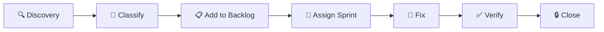

# 📊 Test Matrix Dashboard — Website QLPT

> **Cập nhật:** 28/03/2026 | **10 Modules** | **Target: >80% Pass Rate**

---

## Dashboard Overview

| # | Module | Total Tests | ✅ Passed | ❌ Failed | ⏭️ Skipped | Pass Rate | Status |
|---|--------|:-----------:|:---------:|:---------:|:----------:|:---------:|:------:|
| 1 | **Auth** | 5 | 0 | 0 | 5 | 🔴 0% | ⏳ Sprint 2 |
| 2 | **Properties** | 3 | 0 | 0 | 3 | 🔴 0% | ⏳ Sprint 2 |
| 3 | **Rooms** | 5 | 0 | 0 | 5 | 🔴 0% | ⏳ Sprint 2 |
| 4 | **Tenants** | 2 | 0 | 0 | 2 | 🔴 0% | ⏳ Sprint 2 |
| 5 | **Contracts** | 2 | 0 | 0 | 2 | 🔴 0% | ⏳ Sprint 2 |
| 6 | **Invoices** | 4 | 0 | 0 | 4 | 🔴 0% | ⏳ Sprint 2 |
| 7 | **Maintenance** | 2 | 0 | 0 | 2 | 🔴 0% | ⏳ Sprint 3 |
| 8 | **Chat** | 1 | 0 | 0 | 1 | 🔴 0% | ⏳ Sprint 3 |
| 9 | **Dashboard** | 2 | 0 | 0 | 2 | 🔴 0% | ⏳ Sprint 2 |
| 10 | **TenantPortal** | 3 | 0 | 0 | 3 | 🔴 0% | ⏳ Sprint 3 |
| | **TOTAL** | **29** | **0** | **0** | **29** | **🔴 0%** | |

### Color Legend
- 🔴 Red: Pass Rate < 50%
- 🟡 Yellow: Pass Rate 50-80%
- 🟢 Green: Pass Rate > 80%

---

## Weekly Review Checklist

### Template (Chạy mỗi cuối tuần)

- [ ] 1. Chạy full test suite: `dotnet test`
- [ ] 2. Cập nhật Test Matrix Dashboard (bảng trên)
- [ ] 3. Review new bugs — thêm vào Bug Backlog nếu có
- [ ] 4. Cập nhật Bug Backlog status (OPEN → FIXED → VERIFIED)
- [ ] 5. Kiểm tra sprint deliverables progress

---

## Weekly Report Template

```
### Weekly Report — Tuần [X]
**Date:** [DD/MM/YYYY]
**Sprint:** [Sprint X / 4]

#### Bug Status
- Bugs Fixed tuần này: [N]
- Bugs Remaining: [N]
- New Bugs Found: [N]

#### Test Status
- Total Tests: [N]
- Tests Passing: [N]  
- Test Coverage: [N]%
- Modules >80%: [N] / 10

#### Sprint Progress
- Tasks Done: [N] / [Total]
- Sprint Progress: [N]%
- Blockers: [List or None]

#### Notes
[Ghi chú đặc biệt]
```

---

## Weekly Reports

### Tuần 1 (28/03 — 04/04)
_Chưa chạy — Sẽ cập nhật cuối tuần 1_

### Tuần 2 (07/04 — 11/04)
_Chưa chạy_

### Tuần 3 (14/04 — 18/04)
_Chưa chạy_

### Tuần 4 (21/04 — 25/04)
_Chưa chạy_

---

## Quy Trình Xử Lý Bug Mới



### Chi tiết từng bước:

1. **Discovery** — Phát hiện bug qua testing hoặc sử dụng
2. **Classify** — Phân loại severity:
   - 🔴 CRITICAL: System crash, không khởi động được
   - 🟡 HIGH: Chức năng chính không hoạt động
   - 🟠 MEDIUM: UX issue, có workaround
   - 🟢 LOW: Cosmetic, typo
3. **Add to Backlog** — Thêm vào `docs/bug-backlog.md` với format:
   ```
   ## BUG-[XXX]: [Title]
   | Severity | [CRITICAL/HIGH/MEDIUM/LOW] |
   | Module | [Module name] |
   | Steps to Reproduce | [Steps] |
   | Expected | [Expected behavior] |
   | Actual | [Actual behavior] |
   ```
4. **Assign Sprint** — Dựa theo severity:
   - CRITICAL → Sprint hiện tại (fix ngay)
   - HIGH → Sprint tiếp theo
   - MEDIUM/LOW → Backlog
5. **Fix** — Developer fix và commit
6. **Verify** — Chạy test case liên quan, kiểm tra regression
7. **Close** — Update status trong Bug Backlog, cập nhật Test Matrix
